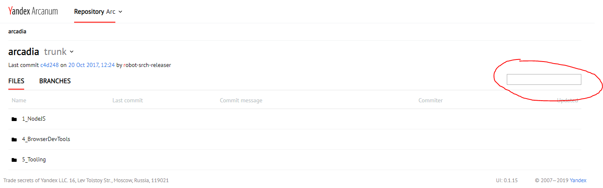
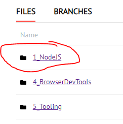

# Ветка с домашним заданием по архитектуре

Проект разрабатывался с использованием NodeJS 10.

## Инструкция по запуску

1. Установить зависимости

   ```
   npm install
   ```

1. Запустить бэкэнд

   ```
   npm run start:backend <путь до корня репозитория>
   ```

1. Запустить сервер фронта

   ```
   npm run start:ui
   ```

## Просмотр результатов

1. Перейти по ссылке http://localhost:8000/my-redux

1. В таблице отобразятся папки, содержащие Git-репозиторий.

   Их можно отфильтровать с помощью контрола над таблицей.

   

1. На главной странице (http://localhost:8000/my-redux) работают переходы по нажатию на имя директории.

   

1. В результате нажатия на эту ссылку, страница перейдет на страницу вида /my-redux/<имя репозитория> 

1. При этом в таблице обновится содержимое репозитория.

1. Файлы в репозитории можно также фильтровать с помощью контрола из п. 2.

1. Просмотр более глубокого уровня вложенности не предусмотрен.

## Расположение исходников

|Директория|Описание|
|---------:|:-------|
|`src/backend/server.js`|Исходники бэкэнда|
|`src/ui/js/my-redux.js`|Моя мини-библиотека редукса|
|`src/ui/js/main.js`|Исходники с бизнес-логикой фильтрации и отображения таблицы|
|`src/ui/server/ui-server.js`|Код сервера фронтенда|
|`src/ui/templates/pages/my-redux.pug`|Pug шаблон указанной страницы|
|`src/ui/sass`|Sass с версткой проекта|